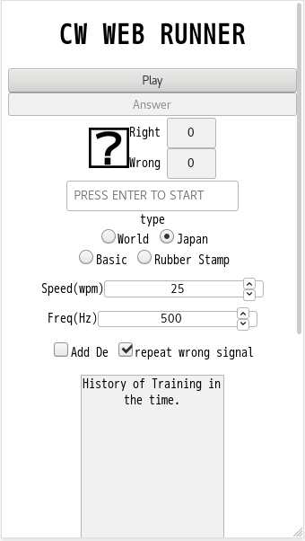

# cw_for_web
====

どんなデバイスでもcw（モールス符号）の聞き取り練習を行えるようにします。
オフラインでも使用かのうなため、ネットワークに接続しにくい環境でも安定して使用可能です。
オフラインで使用する場合は、スマートフォン等でホームに追加を実行し、
アプリとして追加してください。

こちら[CW WEB RUNNER](https://cw.eim.world/), 
[CW TUTOR FOR WEB](https://cw.eim.world/cwTutor.html)をブラウザで開けば使用できます。

### 対象
アマチュア無線家でCWの練習をしたい方。モールス符号に興味を持っている方。

もし、要望・ご意見等あれば、下記Twitter アカウントまたは、本リポジトリの Issue までご連絡ください。
- [tomato3713](https://twitter.com/tomato3713)

## 目次
- [Future](#Future)
    - [Settings](#Settings)
        - [Type](#Type)
        - [Frequency](#Frequency)
        - [Add De](#Add%20De)
        - [repeat wrong signal](#repeat%20wrong%20signal)
- [Usage](#Usage)
- [License](#License)

## Future
### CW WEB RUNNER
詳細な、使用方法については[Usage](#usage)をご覧ください。



アマチュア無線家向けのモールス符号の聞き取り練習ソフトウェアです。

### CW TUTOR FOR WEB


モールス符号の暗記に使用できるソフトウェアです。入力した文字列に対応したモールス符号を聞くことができます。

### Settings

##### Type
下記4つの符号列のタイプを選択して、練習することができます。

- basic:英数字一文字
- japan: 日本のアマチュア無線局のコールサイン
- world: 海外のアマチュア無線局のコールサイン
- Rubber Stamp: ラバースタンプ

##### Frequency
再生する信号の周波数をランダムか固定か選択できます。
ランダムを指定した場合、250Hzから1000Hzの正弦波となります。
固定を指定した場合、テキストボックスに入力された周波数の正弦波が用いられます。

##### Add De
再生する信号の前にDEをつけて再生します。この場合はDEの後のコールを聞き取って回答します。

##### repeat wrong signal
有効にすると間違えた信号を回答できるまで再生します。


## 対応ブラウザ
Web audio API を使っているため、IEには対応していません。
モダンなブラウザなら、動作すると思います。

## Usage
### CW WEB RUNNER
ページ下側にあるラジオボタンでモードを選択します。
ページ上側にあるplayボタンで音を流します。
聞き取れた符号をキーボードでテキストボックスに入力します。
answerボタンをクリックし、答え合わせをします。

PCで使用する場合はEnter keyを押すことで再生、答え合わせがされます。
また、ESCkeyを押すことで符号の再生を中断できます。

回答履歴はページの一番下にあるテキストボックス中に記録されていきます。

### CW TUTOR FOR WEB
テキストボックスに英数字または、ひらがなを入力後、PLAYボタンをクリックしてください。
テキストボックスに入力された文字列に対応したモールス符号が再生されます。

### Text File Format

再生する文字列を1行に1つずつ記入してください。

```example.txt
aaa
bbb
```

## License
Copyright (c) 2019 Taichi Watanabe
Released-under the MIT License

Permission is hereby granted, free of charge, to any person obtaining a copy of this software and associated documentation files (the "Software"), to deal in the Software without restriction, including without limitation the rights to use, copy, modify, merge, publish, distribute, sublicense, and/or sell copies of the Software, and to permit persons to whom the Software is furnished to do so, subject to the following conditions:

The above copyright notice and this permission notice shall be included in all copies or substantial portions of the Software.

THE SOFTWARE IS PROVIDED "AS IS", WITHOUT WARRANTY OF ANY KIND, EXPRESS OR IMPLIED, INCLUDING BUT NOT LIMITED TO THE WARRANTIES OF MERCHANTABILITY, FITNESS FOR A PARTICULAR PURPOSE AND NONINFRINGEMENT. IN NO EVENT SHALL THE AUTHORS OR COPYRIGHT HOLDERS BE LIABLE FOR ANY CLAIM, DAMAGES OR OTHER LIABILITY, WHETHER IN AN ACTION OF CONTRACT, TORT OR OTHERWISE, ARISING FROM, OUT OF OR IN CONNECTION WITH THE SOFTWARE OR THE USE OR OTHER DEALINGS IN THE SOFTWARE.
